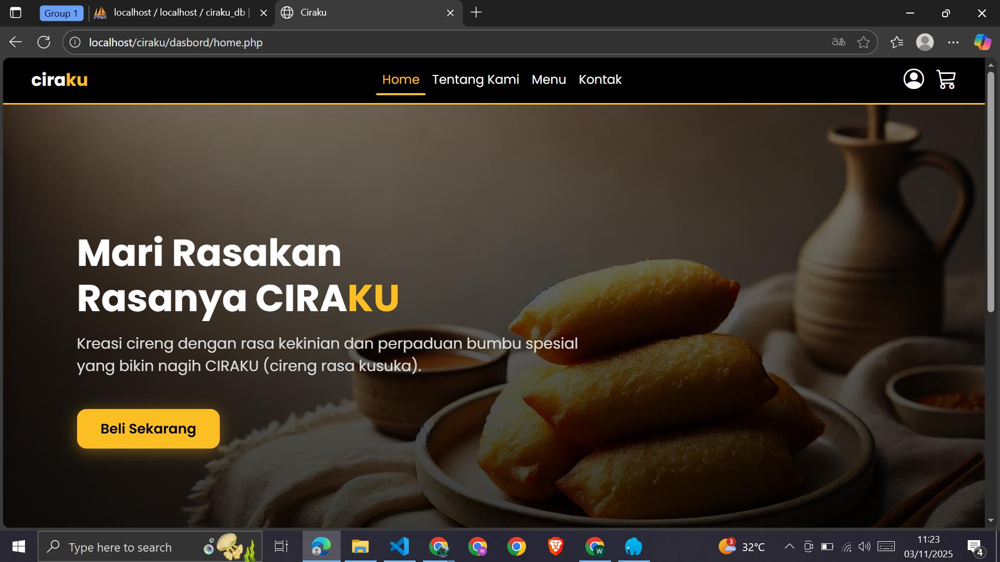

# 🧆 CIRAKU — Aplikasi Pemesanan Cireng Online


## 📖 Deskripsi Proyek

**CIRAKU** adalah aplikasi web berbasis **PHP & MySQL** yang berfungsi untuk melakukan pemesanan dan pengelolaan produk *cireng isi* secara online.
Nama **CIRAKU** sendiri berasal dari singkatan **"Cireng Rasa Kusuka"**, menggambarkan inovasi camilan cireng dengan beragam varian rasa kekinian.

Proyek ini dibuat sebagai tugas akhir mata kuliah **Pemrograman Web** dan dikembangkan oleh **Kelompok 1**.

---

## 👥 Anggota Kelompok

| No | Nama Lengkap                   | NPM          | Role                |
| -- | ------------------------------ | ------------ | ------------------- |
| 1  | **Wisnu Septa Haryanto Putra** | 242502040041 | Fullstack Developer |
| 2  | **Nawfal Krisna Aghafazli**    | 242502040070 | Frontend Developer  |
| 3  | **Ridho Wahyu Saptra**         | 242502040115 | Backend Developer   |

---

## 💻 Teknologi yang Digunakan

* **Bahasa**: PHP 8.3
* **Database**: MySQL (phpMyAdmin 5.2.1)
* **Frontend**: HTML5, CSS3, Bootstrap 5, JavaScript
* **Server Lokal**: XAMPP / Laragon
* **Version Control**: Git & GitHub

Repository GitHub:
🔗 [https://github.com/ridhoye/ciraku.git](https://github.com/ridhoye/ciraku.git)

---

## ⚙️ Fitur Utama

### 👤 Pengguna (User)

* Registrasi dan login akun
* Melihat daftar produk cireng
* Menambahkan produk ke keranjang
* Melakukan pemesanan online
* Melihat status pesanan
* Mengirim pesan atau saran melalui halaman kontak
* Mengubah profil dan foto profil

### 🛠️ Admin

* Login sebagai admin
* Mengelola data produk (CRUD)
* Melihat dan mengubah status pesanan
* Melihat daftar pengguna
* Mengelola pesan/saran yang dikirim pengguna

---

## 🗃️ Struktur Database (`ciraku_db`)

| Tabel            | Deskripsi                            |
| ---------------- | ------------------------------------ |
| **users**        | Menyimpan data akun pengguna & admin |
| **produk**       | Daftar produk cireng isi             |
| **pesanan**      | Transaksi & status pemesanan         |
| **kontak_pesan** | Pesan/saran dari pengguna            |

**Relasi Utama**

* `pesanan.user_id` → `users.id`
* `kontak_pesan.user_id` → `users.id`

---

## 📦 Struktur Folder

```
ciraku/
├── admin/              → Dashboard admin
│   ├── produk.php
│   ├── pesanan.php
│   ├── user.php
│   └── ...
├── user/               → Halaman user
│   ├── home.php
│   ├── menu.php
│   ├── kontak.php
│   ├── profile.php
│   └── ...
├── config/             → File koneksi database
│   └── db.php
├── uploads/            → Gambar produk & profil
├── assets/             → CSS, JS, dan image pendukung
└── index.php           → Halaman utama aplikasi
```

---

## 🚀 Cara Instalasi

### 1️⃣ Ekstrak Proyek

Ekstrak file `ciraku.zip` ke folder:

```
htdocs/ciraku
```

atau

```
laragon/www/ciraku
```

### 2️⃣ Import Database

1. Buka **phpMyAdmin**
2. Buat database baru:

   ```
   ciraku_db
   ```
3. Klik **Import**
4. Pilih file `ciraku_db.sql`
5. Klik **Go / Jalankan**

### 3️⃣ Jalankan Server

* Aktifkan **Apache** dan **MySQL** di XAMPP.
* Buka browser dan akses:

  ```
  http://localhost/ciraku/
  ```

---

## 🔑 Akun Pengujian

### 👨‍💼 Admin

| Username | Password                          |
| -------- | --------------------------------- |
| admin    | admin123 *(atau cek di database)* |

### 👥 User

| Username | Password |
| -------- | -------- |
| wisnu    | 12345    |
| wanto    | 12345    |


## 🖼️ Tampilan Antarmuka

### 🏠 Halaman Utama




### 📦 Daftar Produk


### 📋 Dashboard Admin


*(Pastikan folder `/assets/screenshots/` berisi tangkapan layar sesuai nama di atas.)*


## 🧩 Tujuan Proyek

Proyek ini dibuat untuk memenuhi tugas akhir praktikum mata kuliah **Pemrograman Web**.
Tujuan utama aplikasi ini adalah untuk:

* Meningkatkan pengalaman pemesanan produk lokal secara digital.
* Menerapkan konsep **CRUD**, **authentikasi**, dan **relasi database**.
* Mengasah kemampuan kolaborasi tim dengan **Git & GitHub**.


## 📜 Lisensi

Proyek ini hanya untuk **keperluan akademik (non-komersial)**.
Segala bentuk distribusi ulang atau modifikasi tanpa izin pengembang tidak diperkenankan.

